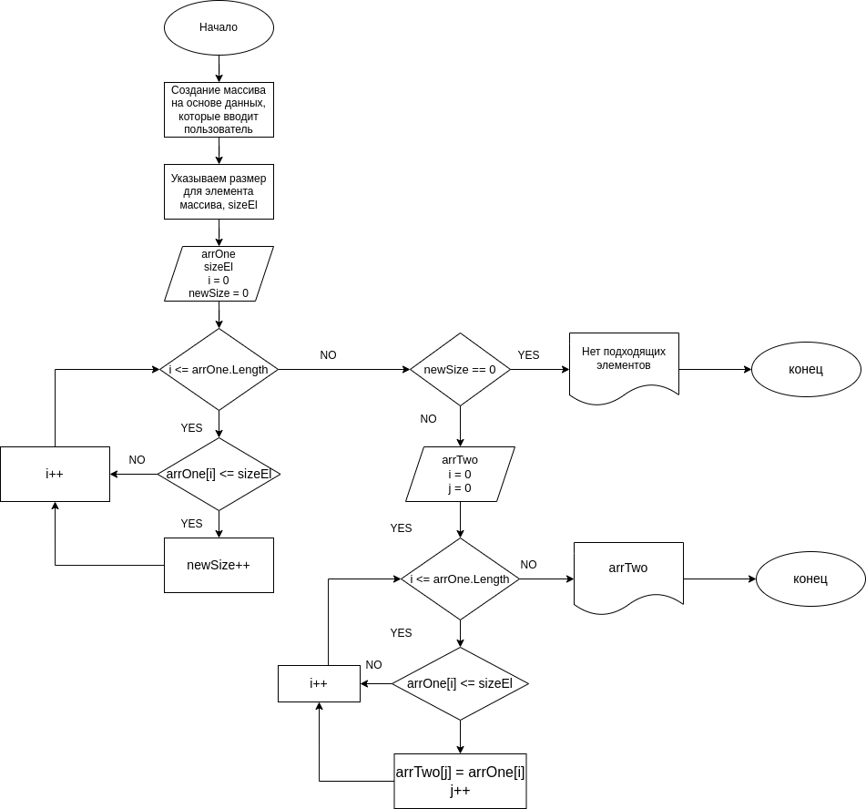

# Итоговая проверочная работа
## Задача:
> Написать программу, которая из имеющегося массива строк формирует новый массив из строк, длина которых меньше, либо равна 3 символам. Первоначальный массив можно ввести с клавиатуры, либо задать на старте выполнения алгоритма. *При решении не рекомендуется пользоваться коллекциями, лучше обойтись исключительно массивами*.
Примеры: [“Hello”, “2”, “world”, “:-)”] → [“2”, “:-)”]
## Алгоритм решения задачи:

## Описание решения:
---
1.  Создается массив на основе данных введенных пользователем (пользователь вводит размер массива и заполняет его с клавиатуры) (`FillArray()`)
2. Размер для элемента массива указывается пользователем(попробовала сделать так, чтобы можно было использовать не только размер указанный в задаче). Оставляя поле пустым будет использоваться число по умолчанию 3. (`SetMaxLenghtEl()`)
3. Проверяем каждый элемент массива и определяем количество элементов, размер которых соответствуют условию. (`FindSizeElem`)
4. Если элементы, соответствующие условию, отсутствуют, программа выдает сообщение об отсутствии элементов и завершается.
5. Если есть подходящие элементы, создается массив размером равным количеству определенным в п.3. (`CreatNewArray`)
6. Возвращаем новый заполненный массив.